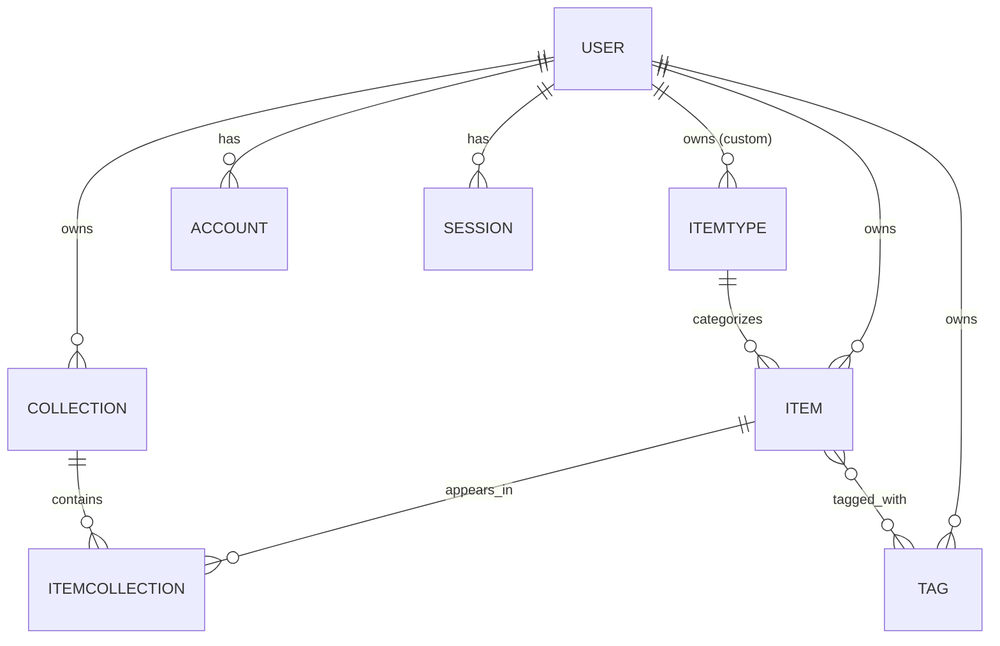
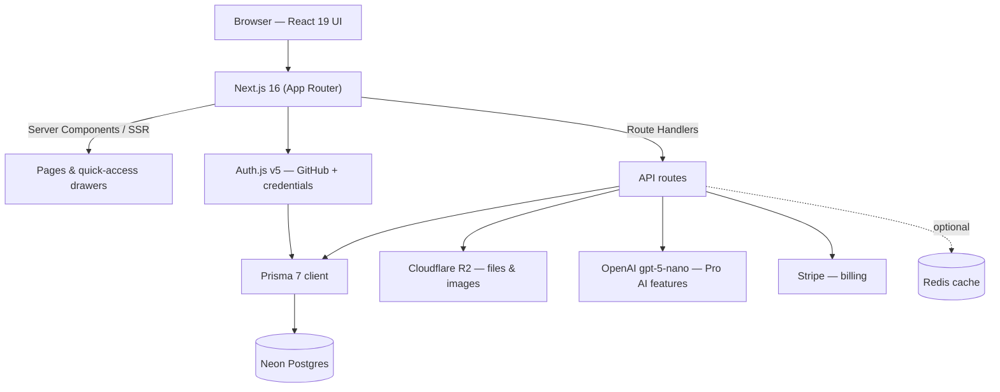

# DevStash — Project Overview

> One fast, searchable, AI-enhanced hub for everything a developer keeps scattered: snippets, prompts, commands, notes, links, and files.

---

## 1. Problem

Developers keep their essentials scattered across too many places:

- Code snippets in VS Code or Notion
- AI prompts buried in chat histories
- Context files lost inside projects
- Useful links in browser bookmarks
- Docs in random folders
- Commands in `.txt` files or shell history
- Project templates in GitHub gists

The result is constant context switching, lost knowledge, and inconsistent workflows. **DevStash consolidates all of it into a single, fast, searchable, AI-enhanced hub.**

## 2. Target Users

| Persona                        | Core need                                                     |
| ------------------------------ | ------------------------------------------------------------- |
| **Everyday Developer**         | Quickly grab and save snippets, prompts, commands, and links. |
| **AI-first Developer**         | Store prompts, contexts, workflows, and system messages.      |
| **Content Creator / Educator** | Keep code blocks, explanations, and course notes organized.   |
| **Full-stack Builder**         | Collect patterns, boilerplates, and API examples.             |

---

## 3. Features

### A. Items & Item Types

Every saved entry is an **Item** with a **type**. Users can eventually create custom types (Pro), but the app ships with seven fixed **system types**:

| Type      | Storage shape | Tier    |
| --------- | ------------- | ------- |
| `snippet` | text          | Free    |
| `prompt`  | text          | Free    |
| `note`    | text          | Free    |
| `command` | text          | Free    |
| `link`    | url           | Free    |
| `file`    | file          | **Pro** |
| `image`   | file          | **Pro** |

Each type resolves to one of three underlying shapes — **text** (snippet, prompt, note, command), **url** (link), or **file** (file, image). Item lists are addressable by type, e.g. `/items/snippets`.

Items must be **fast to create and access** via a quick-access drawer.

### B. Collections

Users create **Collections** that can hold items of any type. An item can belong to **multiple** collections (e.g. a React snippet in both _React Patterns_ and _Interview Prep_).

Examples: _React Patterns_ (snippets, notes) · _Context Files_ (files) · _Python Snippets_ (snippets).

### C. Search

Powerful search across **content, tags, titles, and types**.

### D. Authentication

Email / password **or** GitHub sign-in (see [Auth.js v5](#7-tech-stack) below).

### E. General Features

- Favorite collections and items
- Pin items to the top
- "Recently used" view
- Import code from a file
- Markdown editor for text types
- File upload for file/image types
- Export data in multiple formats
- Dark mode (default for devs), light mode optional
- Add / remove items to / from multiple collections
- View which collections an item belongs to

### F. AI Features — _Pro only_

- AI auto-tag suggestions
- AI summaries
- "Explain this code"
- Prompt optimizer

> Powered by OpenAI `gpt-5-nano` (see stack notes).

---

## 4. Data Model

### Entity-relationship diagram



### Prisma schema

Written for **Prisma 7**. Note the v7-specific changes: the new Rust-free `prisma-client` generator, a now-**required** `output` path (the client is no longer emitted into `node_modules`), and a separate `directUrl` for migrations against Neon's pooled connection.

```prisma
// prisma/schema.prisma

generator client {
  provider = "prisma-client"           // Prisma 7 Rust-free client
  output   = "../src/generated/prisma"  // required in v7
}

datasource db {
  provider  = "postgresql"
  url       = env("DATABASE_URL")  // pooled Neon connection
  directUrl = env("DIRECT_URL")    // direct connection used for migrations
}

// ---------- Enums ----------

enum ContentType {
  text
  file
}

// ---------- Auth.js (NextAuth v5) ----------

model User {
  id            String    @id @default(cuid())
  name          String?
  email         String?   @unique
  emailVerified DateTime?
  image         String?

  // Billing / plan
  isPro                Boolean @default(false)
  stripeCustomerId     String? @unique
  stripeSubscriptionId String? @unique

  // Relations
  accounts    Account[]
  sessions    Session[]
  items       Item[]
  itemTypes   ItemType[]   // custom (non-system) types owned by this user
  collections Collection[]
  tags        Tag[]

  createdAt DateTime @default(now())
  updatedAt DateTime @updatedAt
}

model Account {
  id                String  @id @default(cuid())
  userId            String
  type              String
  provider          String
  providerAccountId String
  refresh_token     String?
  access_token      String?
  expires_at        Int?
  token_type        String?
  scope             String?
  id_token          String?
  session_state     String?

  user User @relation(fields: [userId], references: [id], onDelete: Cascade)

  @@unique([provider, providerAccountId])
}

model Session {
  id           String   @id @default(cuid())
  sessionToken String   @unique
  userId       String
  expires      DateTime
  user         User     @relation(fields: [userId], references: [id], onDelete: Cascade)
}

model VerificationToken {
  identifier String
  token      String
  expires    DateTime

  @@unique([identifier, token])
}

// ---------- Core domain ----------

model Item {
  id          String      @id @default(cuid())
  title       String
  description String?

  contentType ContentType @default(text)
  content     String?     // markdown body — null for file/image items
  language    String?     // optional syntax-highlight hint (snippets/commands)

  // File payload (Cloudflare R2) — null for text items
  fileUrl  String?
  fileName String?
  fileSize Int?

  // Link payload
  url String?

  isFavorite     Boolean   @default(false)
  isPinned       Boolean   @default(false)
  lastAccessedAt DateTime? // powers "Recently used"

  userId     String
  itemTypeId String

  user        User             @relation(fields: [userId], references: [id], onDelete: Cascade)
  itemType    ItemType         @relation(fields: [itemTypeId], references: [id])
  tags        Tag[]            // implicit many-to-many
  collections ItemCollection[]

  createdAt DateTime @default(now())
  updatedAt DateTime @updatedAt

  @@index([userId])
  @@index([itemTypeId])
}

model ItemType {
  id       String  @id @default(cuid())
  name     String  // "snippet", "prompt", ... or a custom name
  icon     String  // lucide icon name, e.g. "Code"
  color    String  // hex, e.g. "#3b82f6"
  isSystem Boolean @default(false)

  userId String?  // null for the 7 system types; set for custom types
  user   User?    @relation(fields: [userId], references: [id], onDelete: Cascade)

  items Item[]

  @@unique([userId, name])
}

model Collection {
  id          String  @id @default(cuid())
  name        String
  description String?
  isFavorite  Boolean @default(false)

  defaultTypeId String? // references ItemType.id — colors empty collections / new items

  userId String
  user   User             @relation(fields: [userId], references: [id], onDelete: Cascade)
  items  ItemCollection[]

  createdAt DateTime @default(now())
  updatedAt DateTime @updatedAt

  @@index([userId])
}

model ItemCollection {
  itemId       String
  collectionId String
  addedAt      DateTime @default(now())

  item       Item       @relation(fields: [itemId], references: [id], onDelete: Cascade)
  collection Collection @relation(fields: [collectionId], references: [id], onDelete: Cascade)

  @@id([itemId, collectionId])
  @@index([collectionId])
}

model Tag {
  id   String @id @default(cuid())
  name String

  userId String
  user   User   @relation(fields: [userId], references: [id], onDelete: Cascade)

  items Item[] // implicit many-to-many

  @@unique([userId, name])
}
```

#### Cleanup decisions baked into the schema _(flag these — they're additions to your draft, not in the original notes)_

- **`Tag` is scoped to a user** (`userId` + `@@unique([userId, name])`). Your draft had `Tag { id, name }` only; without an owner, tags would be shared across all accounts.
- **`Item.lastAccessedAt`** added to back the "Recently used" feature, which had no field for it. ("Recently _added_ to a collection" is already covered by `ItemCollection.addedAt`.)
- **`ContentType` is an enum** rather than a free string.
- **Cascading deletes** added so deleting a user / item / collection cleans up its dependents.
- **`Collection.defaultTypeId`** kept as a plain nullable string referencing `ItemType.id`. Promote it to a real relation if you want DB-level integrity, at the cost of a third `Collection → ItemType` relation.
- **`@@index` on foreign keys** to keep per-user list queries fast.

---

## 5. Architecture



---

## 6. Routing sketch

| Path                      | Purpose                                                |
| ------------------------- | ------------------------------------------------------ |
| `/`                       | Dashboard — grid of color-coded collection cards       |
| `/items/:type`            | Items filtered by type (e.g. `/items/snippets`)        |
| `/collections/:id`        | A single collection's items                            |
| `/api/items`              | CRUD for items                                         |
| `/api/upload`             | R2 file uploads (Pro)                                  |
| `/api/ai/*`               | AI tagging, summaries, explain, prompt-optimizer (Pro) |
| `/api/auth/[...nextauth]` | Auth.js route handler                                  |
| `/api/stripe/webhook`     | Subscription lifecycle events                          |

---

## 7. Tech Stack

> Versions below were checked against current releases (June 2026). Notes flag anything worth knowing before you build.

### Framework — Next.js 16 / React 19

- App Router with Server Components / SSR plus dynamic client components.
- API route handlers for backend needs (items, uploads, AI calls).
- Single codebase / repo.
- **TypeScript** throughout.
- ⚠️ **Next.js 16 renamed middleware to `proxy.ts`** and requires **Node.js 20+**. This matters for auth: don't rely on the proxy/middleware layer alone for session protection (see the CVE-2025-29927 middleware-bypass class of issues) — re-check `auth()` in server components, route handlers, and server actions.
- Docs: <https://nextjs.org/docs> · Upgrade notes: <https://nextjs.org/docs/app/guides/upgrading/version-16>

### Database & ORM — Neon Postgres + Prisma 7

- Neon serverless Postgres in the cloud.
- **Prisma 7** — Rust-free TypeScript client, faster queries, smaller bundles.
- ⚠️ **Two v7 gotchas:** the generated client is **no longer placed in `node_modules`** (an `output` path in the generator block is now required), and config lives in **`prisma.config.ts`**.
- ✅ Prisma 7 ships **built-in guards against destructive commands triggered by AI assistants** — a nice complement to the rule below.
- 🚫 **Never use `prisma db push` or edit the DB structure directly.** Always create migrations, run them in dev, then in prod (`prisma migrate dev` → `prisma migrate deploy`).
- **Redis** for caching — optional / later.
- Docs: <https://www.prisma.io/docs> · Neon: <https://neon.tech/docs>

### File Storage — Cloudflare R2

- Stores `file` and `image` uploads (Pro). `Item.fileUrl` holds the R2 object URL.
- Docs: <https://developers.cloudflare.com/r2/>

### Authentication — Auth.js v5 (NextAuth v5)

- Email / password + GitHub OAuth, using the `@auth/prisma-adapter`.
- ⚠️ **v5 is still published under a `beta` tag** but is widely used in production; pin to a specific version rather than `latest`. Config lives in a single `auth.ts`; use the `auth()` helper everywhere instead of v4's `getServerSession`.
- Docs: <https://authjs.dev>

### AI Integration — OpenAI `gpt-5-nano`

- Cheapest GPT-5 tier (~$0.05 / 1M input, ~$0.40 / 1M output), large context window — well-suited to tagging, summaries, and prompt optimization.
- _(A newer `gpt-5.4-nano` exists if you later want vision/image input; `gpt-5-nano` is fine for text-only AI features.)_
- Docs: <https://platform.openai.com/docs>

### CSS / UI — Tailwind CSS v4 + shadcn/ui

- shadcn/ui fully supports Tailwind v4 + React 19. A few v4 conventions: theme tokens live under the `@theme` directive (no `tailwind.config.js`), colors use OKLCH, `new-york` is the default style, and toasts use **sonner** (the old `toast` component is deprecated).
- Docs: <https://tailwindcss.com/docs> · <https://ui.shadcn.com/docs/tailwind-v4>

---

## 8. Monetization (Freemium)

|                      | **Free**              | **Pro — $8/mo or $72/yr**                    |
| -------------------- | --------------------- | -------------------------------------------- |
| Items                | 50 total              | Unlimited                                    |
| Collections          | 3                     | Unlimited                                    |
| System types         | All except file/image | All                                          |
| File & image uploads | ❌                    | ✅                                           |
| Search               | Basic                 | Full                                         |
| AI features          | ❌                    | ✅ (auto-tag, explain, optimizer, summaries) |
| Custom types         | ❌                    | ✅ _(later)_                                 |
| Data export          | ❌                    | ✅ (JSON / ZIP)                              |
| Support              | Standard              | Priority                                     |

> **During development, gate nothing** — all users get everything. Build the `isPro` / Stripe plumbing now so flipping the gates on at launch is trivial.

---

## 9. UI / UX

### Principles

- Modern, minimal, developer-focused. References: **Notion, Linear, Raycast**.
- **Dark mode by default**, light mode optional.
- Clean typography, generous whitespace, subtle borders and shadows.
- Syntax highlighting for code blocks.

### Layout

- **Sidebar + main content**, sidebar collapsible.
  - _Sidebar:_ item types (Snippets, Commands, …) linking to their lists; latest collections.
  - _Main:_ grid of collection cards, **background-colored by the type they hold most of**; items render beneath as cards **border-colored by their type**.
- Individual items open in a **quick-access drawer**.

### Type colors & icons

| Type    | Color      | Hex       | Lucide icon  |
| ------- | ---------- | --------- | ------------ |
| Snippet | 🔵 Blue    | `#3b82f6` | `Code`       |
| Prompt  | 🟣 Purple  | `#8b5cf6` | `Sparkles`   |
| Command | 🟠 Orange  | `#f97316` | `Terminal`   |
| Note    | 🟡 Yellow  | `#fde047` | `StickyNote` |
| File    | ⚪ Gray    | `#6b7280` | `File`       |
| Image   | 🩷 Pink    | `#ec4899` | `Image`      |
| Link    | 🟢 Emerald | `#10b981` | `Link`       |

### Responsiveness & polish

- Desktop-first but mobile-usable; the sidebar collapses to a drawer on mobile.
- **Micro-interactions:** smooth transitions, card hover states, toast notifications for actions, loading skeletons.

---

## 10. Open questions / parking lot

- **Search backend:** Postgres full-text / `pg_trgm` to start; reach for a dedicated search service only if it becomes a bottleneck.
- **Recently used:** confirm whether it means recently _viewed_ (`lastAccessedAt`) or recently _edited_ (`updatedAt`) — the schema supports both.
- **Custom types (Pro):** the `ItemType` table already supports them via nullable `userId`; just needs UI + the plan gate.
- **Export formats:** JSON for text-only stashes; ZIP when files/images are involved.
